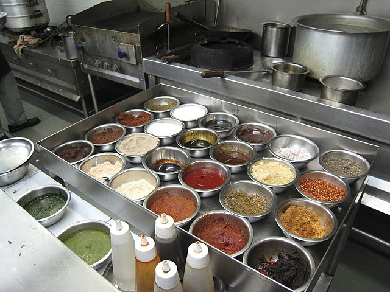

# mise-en-place

Welcome to my dot files, configuration files and other things that make up my workplace setup before cooking some code (French: [mise-en-place](https://en.wikipedia.org/wiki/Mise_en_place), a term coined by the amazing [@andim](https://www.github.com/andim)) :)

  
Credit: Charles Haynes on [Wikimedia Commons](https://commons.wikimedia.org/wiki/File:Mise_en_place_for_hot_station.jpg) ([CC BY-SA 2.0](https://creativecommons.org/licenses/by-sa/2.0/)) 

## OS

I am currently using Mint, but I will change to Ubuntu in the long term.

## Shell

I am currently switching from bash to [fish](https://fishshell.com/) as my default shell.
